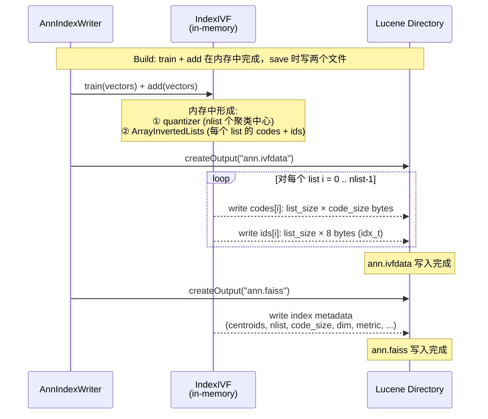
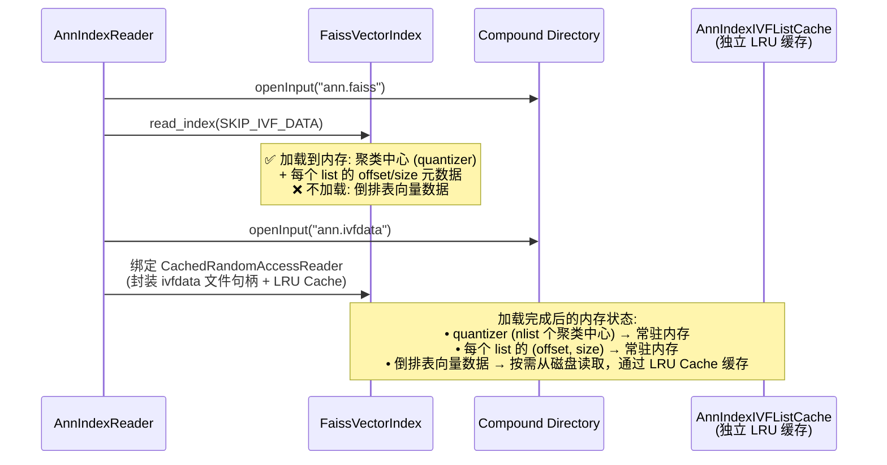
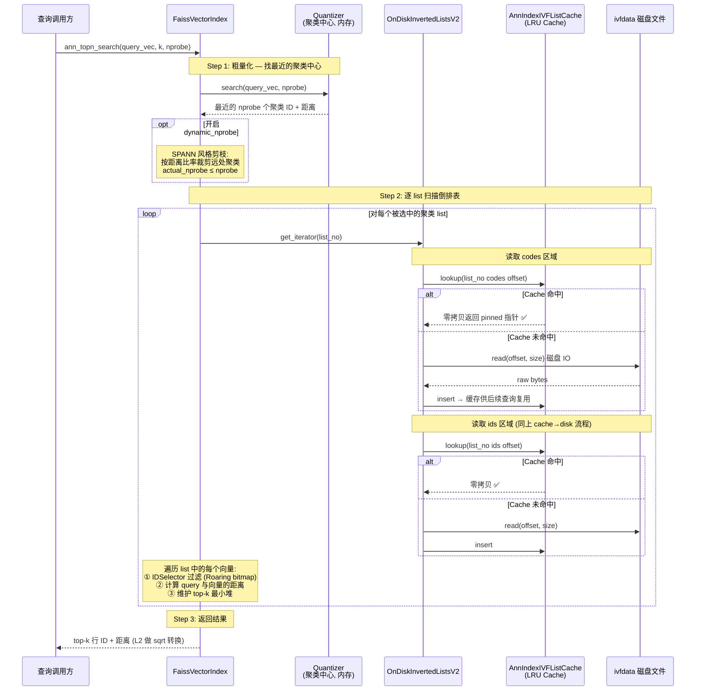

以下是拆分后的三个时序图，分别覆盖 **写入（Build）**、**加载（Load）** 和 **搜索（Search）** 三个关键流程。

---

## 图 1：Build 阶段 — 写入两个文件



**ann.ivfdata 文件的 Binary 布局：**

```text
┌─────────── list 0 ──────────┬─────────── list 1 ──────────┬── ... ──┬─────── list N-1 ────────┐
│ codes (size×code_size bytes) │ codes (size×code_size bytes) │         │ codes                    │
│ ids   (size×8 bytes)         │ ids   (size×8 bytes)         │         │ ids                      │
└──────────────────────────────┴──────────────────────────────┴─────────┴──────────────────────────┘
```

**ann.faiss 文件：** 仅包含索引元数据（聚类中心向量、nlist、code_size、维度、距离类型等），**不包含倒排表数据**。

---

## 图 2：Load 阶段 — 只加载聚类中心到内存



---

## 图 3：Search 阶段 — 粗量化 → 按 list 访问 → Cache / IO



---

### 三图总结

| 阶段 | 核心行为 | 磁盘文件 | 内存占用 |
|------|---------|---------|---------|
| **Build** | train + add 后写出两个文件 | `ann.faiss` (元数据) + `ann.ivfdata` (倒排表) | 构建时全量，写完释放 |
| **Load** | 只读 centroids + list offset 元数据 | 读 `ann.faiss`，绑定 `ann.ivfdata` 文件句柄 | 极低（仅聚类中心） |
| **Search** | 粗量化 → 按 list 读数据（cache 优先）→ top-k | 按需读 `ann.ivfdata` 中对应 list | 热点 list 缓存在独立 LRU Cache |

## 关键流程说明

### 整体架构分三个阶段：

**Phase 1 — 索引加载（仅首次，`DorisCallOnce`）**
- ann_index_reader.cpp 打开 Compound 文件，通过 `faiss::read_index` 以 `IO_FLAG_SKIP_IVF_DATA` 标志**只读取元数据**（聚类中心向量/nlist/code_size），不加载倒排表数据
- 将 `OnDiskInvertedLists` 替换为 OnDiskInvertedListsV2.h（无 mmap、基于 `RandomAccessReader` 的读取方式）
- 创建 faiss_ann_index.cpp 绑定到 V2，它封装了 CLucene `IndexInput`（clone）并接入 ann_index_ivf_list_cache.h（独立 LRU 缓存）

**Phase 2 — 搜索（每次查询）**
1. **粗量化（Coarse Quantization）**：用内存中的 quantizer（`IndexFlat`）对 query_vec 搜索最近的 nprobe 个聚类中心
2. **动态 nprobe 剪枝**（可选，SPANN 风格）：通过 faiss_ann_index.cpp 根据距离比率裁剪不需要探测的聚类
3. **倒排表扫描**：对每个需要探测的聚类，OnDiskInvertedListsV2.cpp 通过 `borrow()` 一次性获取整个 list 的 codes 和 ids
4. **缓存机制**：`CachedRandomAccessReader::borrow()` 以精确 `(prefix, file_size, offset)` 为 key 查询 LRU cache，命中则**零拷贝**返回 pinned 指针；未命中则从磁盘读取后插入缓存
5. 在扫描过程中，FAISS 通过 `IDSelector`（封装 Roaring bitmap）过滤无效行，计算距离并维护 top-k 堆

**Phase 3 — 结果转换**
- 将 FAISS 返回的 `labels[]` 转换为 Roaring bitmap
- L2 距离做 `sqrt`（FAISS 返回的是平方距离）
- 收集 cache hit/miss 统计，写入 `AnnIndexStats` 和 `DorisMetrics`

### 核心设计亮点
- **内存占用极低**：只有聚类中心在内存中，倒排表数据全部 on-disk
- **缓存粒度与访问模式完美对齐**：每个 IVF list 的 codes 和 ids 各对应一个缓存条目，重复查询同一聚类时零拷贝命中
- **独立缓存池**：`AnnIndexIVFListCache` 与列数据/索引页缓存分离，容量可独立调优（默认物理内存 70%） 

Completed: *Draw sequence diagram* (3/3)