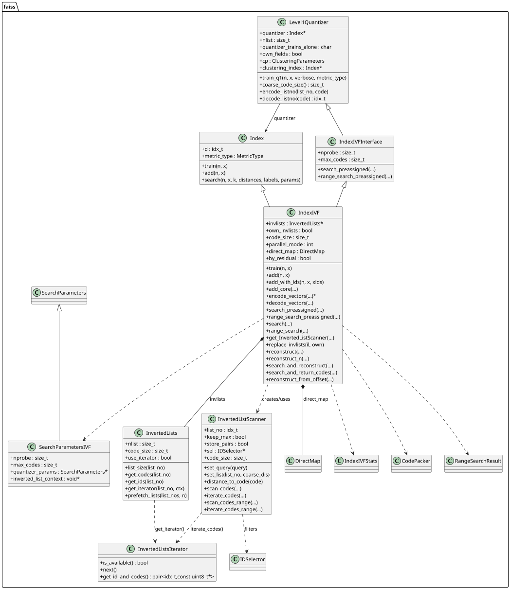
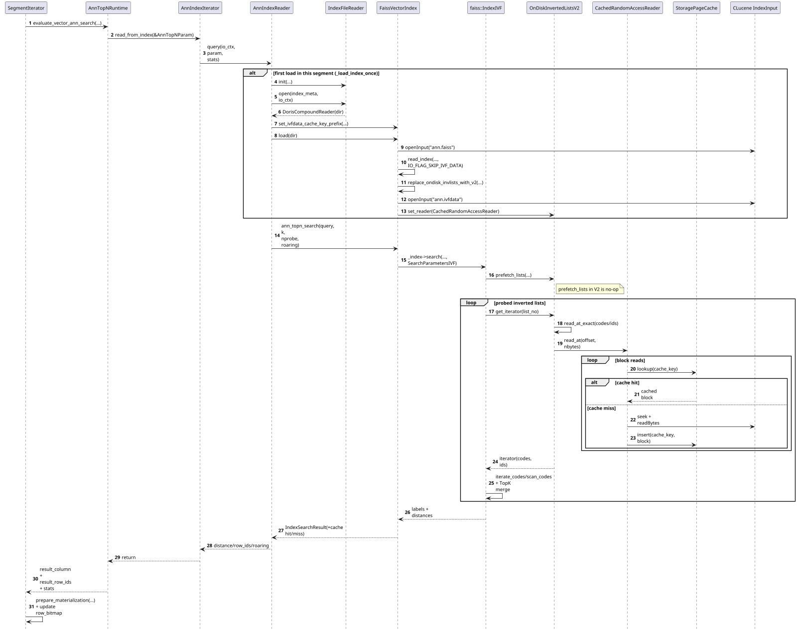

# Faiss IVF 结构与索引文件笔记

<style>
pre code {
  font-size: 13px;
  line-height: 1.55;
}
</style>

## 类关系图


## 查询流程（`IndexIVF::search`）
```cpp
void IndexIVF::search(
        idx_t n, // 本次查询有多少个 query
        const float* x, // query 数组的指针
        idx_t k, // TopK
        float* distances,   // 返回值将会是：k * n 个 distances
        idx_t* labels,      // 返回值将会是：k * n 个 id
        const SearchParameters* params_in) {
    // NOTE: 并行模式下，会有 x 个 omp 线程并行查询，每个线程完成一组 query 的查询过程
    auto sub_search_func = [this, k, nprobe, params](
                                   idx_t n,      // 当前线程负责的 query 数量
                                   const float* x,
                                   float* distances,
                                   idx_t* labels,
                                   IndexIVFStats* ivf_stats) {
        // n 个查询，每个查询搜索 nprobe 个桶 -> n * nprobe
        std::unique_ptr<idx_t[]> idx(new idx_t[n * nprobe]);
        std::unique_ptr<float[]> coarse_dis(new float[n * nprobe]);

        // 粗筛：得到每个 query 的候选桶和对应粗距离
        quantizer->search(
                n,
                x,
                nprobe,
                coarse_dis.get(),
                idx.get(),
                params ? params->quantizer_params : nullptr);

        // 预取倒排列表
        invlists->prefetch_lists(idx.get(), n * nprobe);

        // 在候选桶内做精确匹配
        search_preassigned(
                n,
                x,
                k,
                idx.get(),
                coarse_dis.get(),
                distances,
                labels,
                false,
                params,
                ivf_stats);
    };
}
```

## 粗筛过程
粗筛的逻辑比较直接：索引有 `nlist` 个质心，计算 query 到各质心距离后，取最近的 `nprobe` 个桶。这一步骤本质是在质心上进行暴力搜索，所以 IndexIVF 里最常见的用来保存质心的对象是 `IndexFlatL2`。

## 精筛过程
精筛整体过程是在粗筛返回的分桶列表里做 `TopN` 的暴力计算。
```cpp
init_topk_heap(simi, idxi, k);

for each probed_list in coarse_result {
    scanner->set_list(probed_list.id, probed_list.coarse_distance);

    // 读取该桶中的向量编码和对应 id
    codes, ids = invlists->get_list(probed_list.id);

    // 逐个候选向量计算真实距离，并尝试更新全局 TopK
    for each (code, id) in (codes, ids) {
        distance = scanner->compute_distance(query, code);
        heap_push_or_replace_topk(simi, idxi, distance, id, k);
    }
}

sort_topk_result(simi, idxi, k);
```
核心就是 3 步：

1. 根据粗筛结果确定要扫描的 `nprobe` 个桶。
2. 读取每个桶里的向量编码，计算 query 和桶内所有候选的真实距离。
3. 把各桶的局部结果持续合并到全局 `TopK`，得到最终返回结果。


## 文件存储格式
### IVF In Memory
```text
code_size = d × sizeof(float) = 64 × 4 = 256 字节
假设每桶平均 ~78 个向量 (20000 / 256)

═══════════════════════════════════════════════════════════════
                     .index 文件完整布局
═══════════════════════════════════════════════════════════════

┌─────────────────────────────────────────────────────────────┐
│  ① IndexIVFFlat fourcc                                      │
│     "IwFl"                                        (4 字节)  │
├─────────────────────────────────────────────────────────────┤
│  ② write_index_header (IndexIVFFlat 基类 Index 头)          │
│     d           = 64                              (4 字节)  │
│     ntotal      = 20000                           (8 字节)  │
│     dummy       = 1<<20                           (8 字节)  │
│     dummy       = 1<<20                           (8 字节)  │
│     is_trained  = true                            (1 字节)  │
│     metric_type = 1 (METRIC_L2)                   (4 字节)  │
├─────────────────────────────────────────────────────────────┤
│  ③ IVF 特有字段                                              │
│     nlist       = 256                             (8 字节)  │
│     nprobe      = 1                               (8 字节)  │
├─────────────────────────────────────────────────────────────┤
│  ④ quantizer (递归 write_index → IndexFlatL2)               │
│  ┌──────────────────────────────────────────────────────┐   │
│  │  fourcc      = "IxF2"                      (4 字节)  │   │
│  │  d           = 64                          (4 字节)  │   │
│  │  ntotal      = 256                         (8 字节)  │   │
│  │  dummy × 2                                (16 字节)  │   │
│  │  is_trained  = true                        (1 字节)  │   │
│  │  metric_type = 1                           (4 字节)  │   │
│  │  codes_size  (XBVECTOR 头)                 (8 字节)  │   │
│  │  codes: 256 个质心 × 64 × 4 = 65536 字节             │   │
│  └──────────────────────────────────────────────────────┘   │
├─────────────────────────────────────────────────────────────┤
│  ⑤ DirectMap                                                │
│     type = 0 (NoMap)                              (1 字节)  │
│     array_size = 0                                (8 字节)  │
├═════════════════════════════════════════════════════════════╡
│  ⑥ write_InvertedLists (ArrayInvertedLists)                 │
│                                                             │
│  ┌──────────────────────────────────────────────────────┐   │
│  │  fourcc     = "ilar"                       (4 字节)  │   │
│  │  nlist      = 256                          (8 字节)  │   │
│  │  code_size  = 256                          (8 字节)  │   │
│  ├──────────────────────────────────────────────────────┤   │
│  │  list_type  = "full"                       (4 字节)  │   │
│  │  sizes_size = 256                          (8 字节)  │   │
│  │  sizes[0]   = 82  (桶0有82个向量)          (8 字节)  │   │
│  │  sizes[1]   = 75                           (8 字节)  │   │
│  │  sizes[2]   = 80                           (8 字节)  │   │
│  │  ...                                                 │   │
│  │  sizes[255] = 71                           (8 字节)  │   │
│  │                              sizes总计: 256×8=2048字节│   │
│  ├──────────────────────────────────────────────────────┤   │
│  │                                                      │   │
│  │  ⭐ 桶 0 (82 个向量)                                 │   │
│  │  ┌─ codes ──────────────────────────────────────┐    │   │
│  │  │  code[0]:  256 字节                          │    │   │
│  │  │  code[1]:  256 字节                          │    │   │
│  │  │  ...                                         │    │   │
│  │  │  code[81]: 256 字节                          │    │   │
│  │  │                      小计: 82 × 256 = 20992  │    │   │
│  │  ├─ ids ────────────────────────────────────────┤    │   │
│  │  │  id[0]:  8 字节 (idx_t)                      │    │   │
│  │  │  id[1]:  8 字节                              │    │   │
│  │  │  ...                                         │    │   │
│  │  │  id[81]: 8 字节                              │    │   │
│  │  │                      小计: 82 × 8 = 656      │    │   │
│  │  └──────────────────────────────────────────────┘    │   │
│  │                                                      │   │
│  │  ⭐ 桶 1 (75 个向量)                                 │   │
│  │  ┌─ codes ──────────────────────────────────────┐    │   │
│  │  │  code[0] ~ code[74]                          │    │   │
│  │  │                      小计: 75 × 256 = 19200  │    │   │
│  │  ├─ ids ────────────────────────────────────────┤    │   │
│  │  │  id[0] ~ id[74]                              │    │   │
│  │  │                      小计: 75 × 8 = 600      │    │   │
│  │  └──────────────────────────────────────────────┘    │   │
│  │                                                      │   │
│  │  ...（跳过空桶，sizes[i]==0 的桶不写任何数据）        │   │
│  │                                                      │   │
│  │  ⭐ 桶 255 (71 个向量)                                │   │
│  │  ┌─ codes ──────────────────────────────────────┐    │   │
│  │  │  code[0] ~ code[70]                          │    │   │
│  │  │                      小计: 71 × 256 = 18176  │    │   │
│  │  ├─ ids ────────────────────────────────────────┤    │   │
│  │  │  id[0] ~ id[70]                              │    │   │
│  │  │                      小计: 71 × 8 = 568      │    │   │
│  │  └──────────────────────────────────────────────┘    │   │
│  └──────────────────────────────────────────────────────┘   │
└─────────────────────────────────────────────────────────────┘

倒排表数据总大小:
  codes: 20000 × 256 = 5,120,000 字节
  ids:   20000 × 8   =   160,000 字节
  合计:                 5,280,000 字节 ≈ 5.03 MB
```

上述例子里 `InvertedLists` 使用的是 `ArrayInvertedLists`，按桶顺序串行写入每个桶的 `codes` 和 `ids`，空桶不会写入实际数据区。

## IVF On Disk 文件格式（对照 IVF In Memory）

下面按“IVF In Memory 的思路”画出 `OnDiskInvertedLists` 的文件结构：

```text
[文件1] xxx.index   (索引元数据文件)
┌──────────────────────────────────────────────────────────────┐
│ faiss index header (IVF/PQ 等常规 header)                    │
│   ...                                                        │
│ invlists = OnDiskInvertedLists (IOHook: "ilod")             │
│   fourcc = "ilod"                                            │
│   nlist                                                      │
│   code_size                                                  │
│   lists[0..nlist-1]                                          │
│     each: { size, capacity, offset }                         │
│   slots[0..K-1]    // 空闲块管理信息（offset, capacity）      │
│   filename         // 指向下面的 ivfdata 文件                 │
│   totsize          // ivfdata 总 mmap 大小                    │
└──────────────────────────────────────────────────────────────┘

[文件2] xxx.ivfdata  (倒排实际数据文件，mmap)
┌──────────────────────────────────────────────────────────────┐
│ block for list 0 (at lists[0].offset)                        │
│   codes[capacity0 * code_size]                               │
│   ids  [capacity0]                                            │
│                                                              │
│ block for list 1 (at lists[1].offset)                        │
│   codes[capacity1 * code_size]                               │
│   ids  [capacity1]                                            │
│                                                              │
│ ...                                                          │
│                                                              │
│ block for list i (at lists[i].offset)                        │
│   codes[capacityi * code_size]                               │
│   ids  [capacityi]                                            │
│   // 实际有效元素数 = lists[i].size                           │
│   // capacity-size 部分为预留空间                             │
└──────────────────────────────────────────────────────────────┘
```

对照 In-Memory 可理解为：
- In-Memory：`codes/ids` 在进程内存里。
- On-Disk：`codes/ids` 搬到 `ivfdata`，通过 `offset` + `mmap` 访问；`index` 里只留目录和元信息。

## Doris IVF_ON_DISK 搜索时序图（PlantUML）

